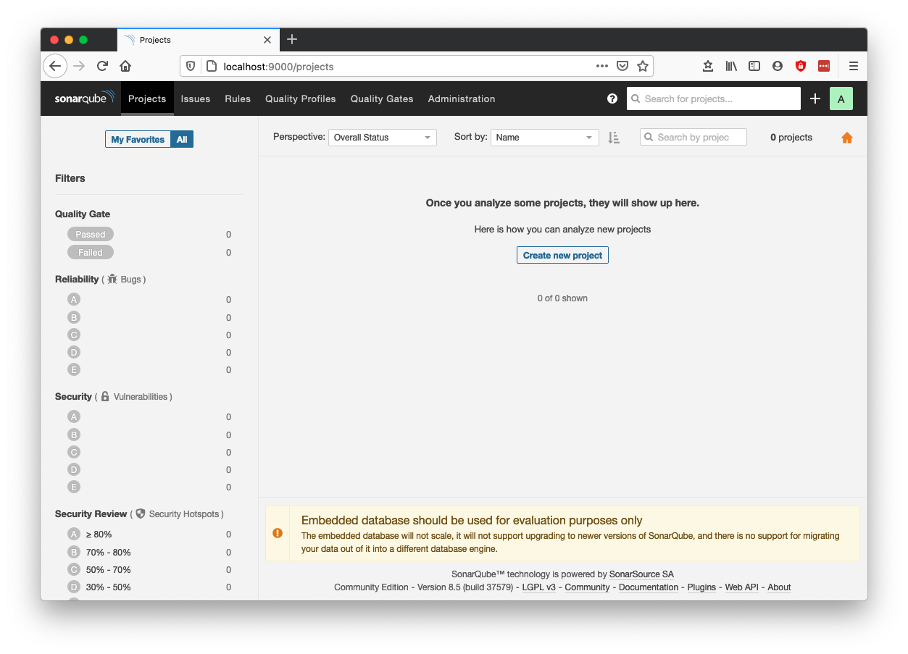
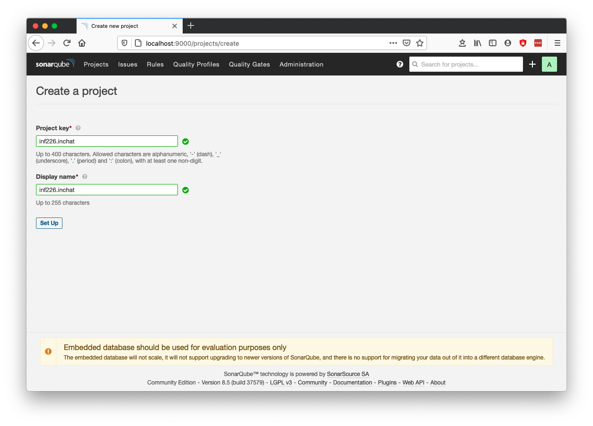
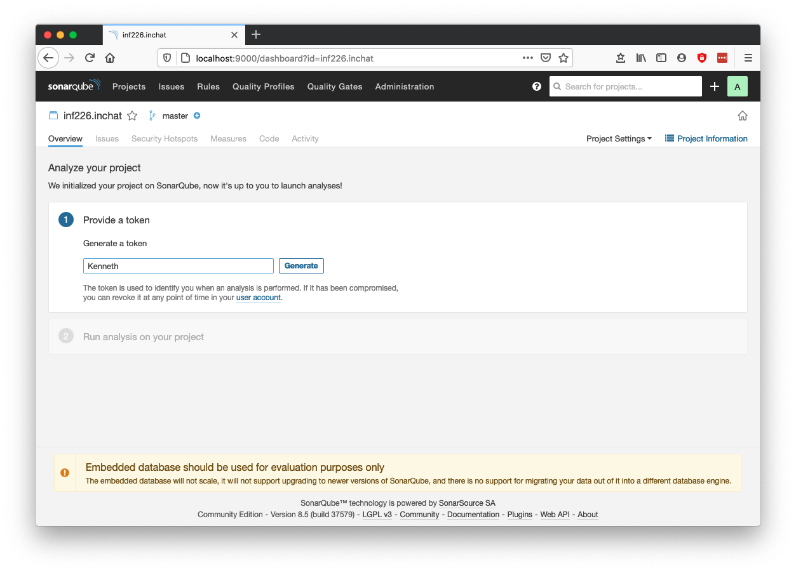
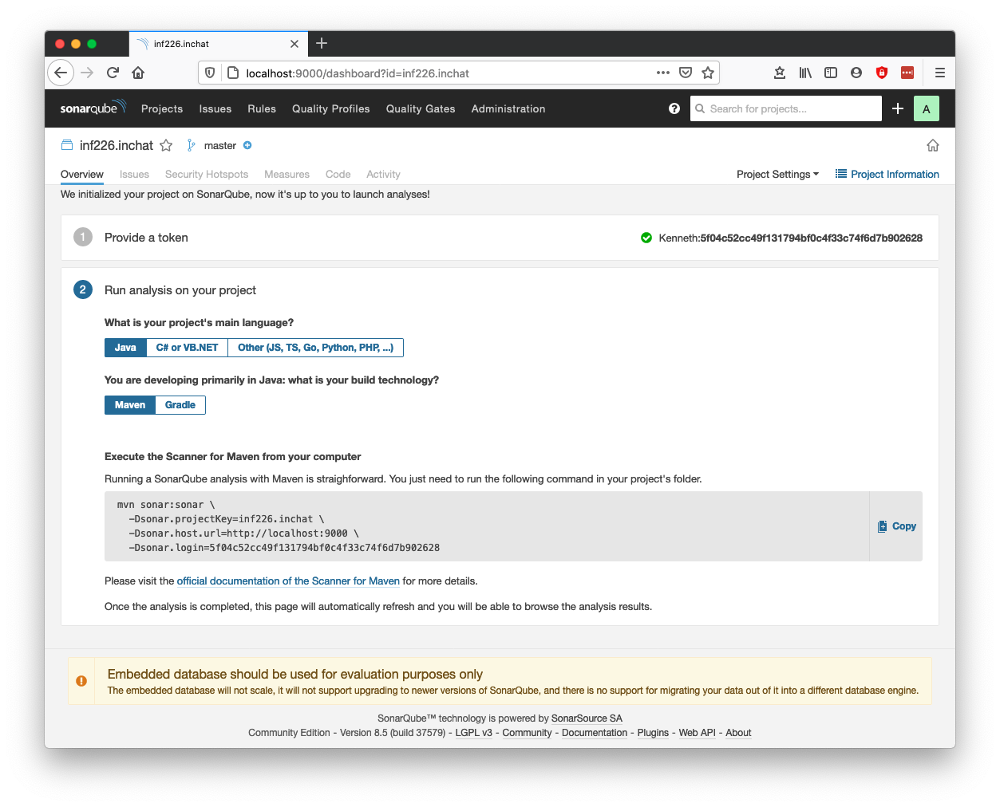
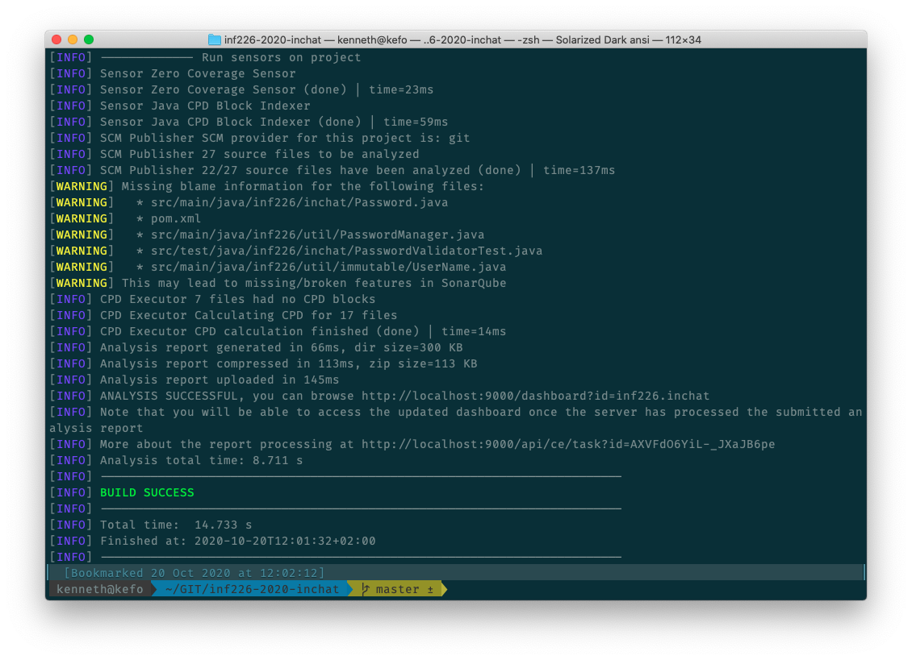
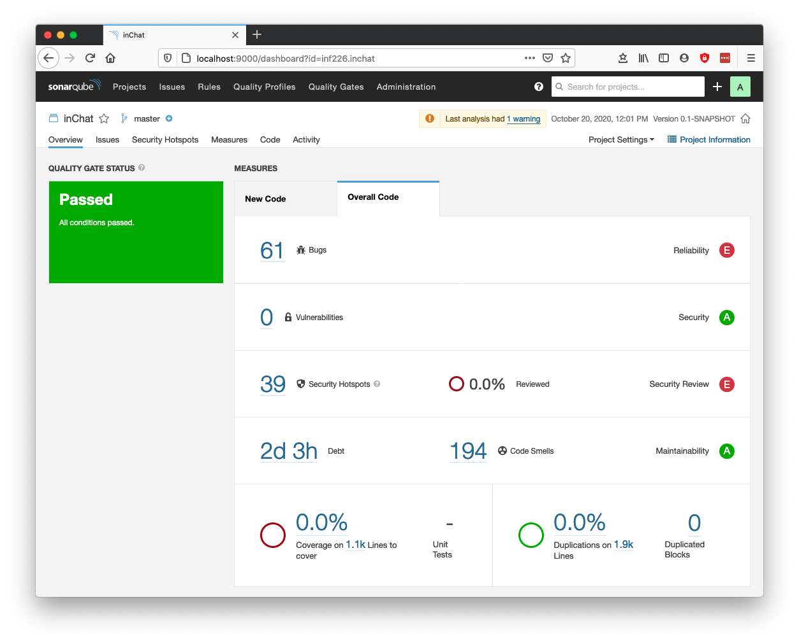

# Setting up your project in SonarQube

## 1.SetupScreen



### 2.ProjectKey

Project Key is the groupId and artifactId together.

```sh
 kenneth@kefo ~/inf226-2020-inchat > cat -n pom.xml
     1	<project xmlns="http://maven.apache.org/POM/4.0.0"
     2	         xmlns:xsi="http://www.w3.org/2001/XMLSchema-instance"
     3	         xsi:schemaLocation="http://maven.apache.org/POM/4.0.0 http://maven.apache.org/maven-v4_0_0.xsd">
     4	
     5	  <modelVersion>4.0.0</modelVersion>
     6	  <groupId>inf226</groupId>            <-- THIS ONE
     7	  <artifactId>inchat</artifactId>      <-- THAT ONE
     8	  <version>0.1-SNAPSHOT</version>
     9	  <packaging>jar</packaging>
    10	  <name>inChat</name>
    11	
...
```



### 3.Token

Key name is not important, it is to identity who, so you can revoke it later in bigger projects.
Take good care of your key:

5f04c52cc49f131794bf0c4f33c74f6d7b902628

Generate the key



### 4.Run Analyzis



Copy the command and run it in the root of your project.



This command can be run several times, as you progress through the project.

### 5. Review

Start reviewing the project when this screen appears

